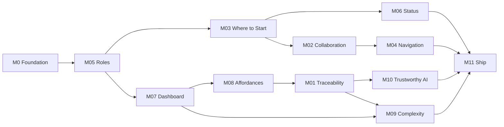

# TaxPlatform — Project Roadmap

Product UI name: **GreenGrowth**. Rough delivery roadmap for the case study prototype. Each **challenge is a milestone**. Foundational scaffolding (M0) is done; challenge milestones ship interactive UX on that shell.

**Companion docs:** [project overview.md](./project%20overview.md) · [case study PDF](./AI_Engineer_Case_Study_Updated.pdf)

**Budget:** 36–48 hours total · **Video:** 5–10 min · **Stack:** Next.js + TypeScript + shadcn · **Host:** Vercel

---

## Guiding rules

| Rule | Meaning |
| --- | --- |
| One product spine | Extend the existing client/firm shell; do not spawn parallel demos |
| Fake the guts | Seeded fixtures + `simulateAI()` stubs; no real OCR/auth/LLM |
| Video path first | Prefer depth on screens in the 5–10 min walkthrough |
| Milestone = challenge | Done means acceptance criteria below are clickable, not “designed on paper” |
| Spec later if needed | For heavy milestones, optional `docs/implementations/<milestone>.md` before coding |

---

## Milestone map

| ID | Challenge | Depends on | Est. | Status |
| --- | --- | --- | --- | --- |
| **M0** | Foundation (scaffold) | — | ~4–6h | **Done** |
| **M05** | Role-Aware Experiences | M0 | ~3–4h | Partial (dual-context done; Riley/extra lenses deferred) |
| **M03** | Where to Start | M05 | ~4–5h | **Done** (picker trimmed to 2) |
| **M06** | Return Status & Progress | M03 | ~3–4h | **Done** (client-only) |
| **M02** | Client & CPA Collaboration | M03 | ~4–5h | **Done** (client; firm deferred) |
| **M04** | Getting Lost in the App | M02 | ~3–4h | **Done** (client loop) |
| **M07** | An Actionable Dashboard | M05 | ~4–5h | **Done** |
| **M08** | Clickable vs. Editable | M07 | ~3–4h | **Done** (Alex review + dashboard chips) |
| **M01** | Source Document Traceability | M08 | ~5–6h | **Done** (fake W-2 side panel) |
| **M10** | Trustworthy AI | M01, M08 | ~4–5h | **Done** (`simulateAI` + accept/edit/reject) |
| **M09** | Complexity Made Navigable | M07, M01 | ~4–5h | **Done** (~150 returns + search/entity) |
| **M11** | Ship (README, deploy, video) | All | ~3–4h | Not started |

Suggested order above follows the **client-first demo narrative**, then firm depth. Parallelizable after M05: client track (M03→M06→M02→M04) and firm track (M07→M08→M01→M10), merge for M09/M11.

---

## M0 — Foundation (complete)

### Feature summary
Scaffold Next.js App Router app with shadcn, calm-fintech theme, persona picker, client/firm shells, and seed fixtures.

### Goals
- Runnable local app with shared shell and demo personas
- Placeholder routes for the video path
- Types + seed data ready for challenge milestones

### Non-goals
- Real auth, APIs, OCR, tax engine
- Pixel-perfect challenge UX

### Acceptance criteria
- [x] `npm run dev` serves persona picker at `/`
- [x] Client shell: `/client/home`, tasks, documents, messages
- [x] Firm shell: `/firm/dashboard`, `/firm/returns/[id]`
- [x] In-app persona switcher
- [x] Seed returns/tasks/docs/threads for Alex, Sam, Jordan

---

## M05 — Role-Aware Experiences

### Feature summary
One product shell that adapts navigation, permissions copy, and landing routes by persona — including multi-role Jordan (firm vs personal return).

### Goals
- Clear permission / context differences across personas
- Firm employee with personal return feels like context switch, not a second product

### Non-goals
- Real RBAC engine
- Unique full app per all six roles (nav + permission deltas are enough)

### UI / routes
- Refine `/` persona picker
- Role-aware nav items in client/firm headers
- Optional “You are viewing as…” permission banners

### Acceptance criteria
- [x] Switching personas changes nav and home destination
- [x] Jordan (preparer) vs Jordan (personal) demonstrates dual context
- [ ] Riley (reviewer) shows reduced edit affordances vs Jordan — **deferred**
- [ ] At least four of six role lenses are represented in picker or switcher — **deferred** (Alex + Jordan CPA + Jordan personal)

### Edge cases
- Switching mid-return preserves deep link where possible or lands on role home with toast

**Scope note:** Dual-context polish in [jordan-dual-context.md](./implementations/jordan-dual-context.md). Sam/Riley/admin/seasonal remain off picker/switcher.

---

## M03 — Where to Start

### Feature summary
Cold client (Alex) understands the single next action within ~10 seconds; chrome is deferred until relevant.

### Goals
- Ruthless first-run hierarchy
- Progress + urgency without clutter
- Post-onboarding home variant

### Non-goals
- Full questionnaire product
- Marketing onboarding carousel

### UI / routes
- `/client/home` primary CTA + short task list
- Hidden advanced nav until first task complete (toggleable demo state)

### Acceptance criteria
- [x] New-client home has one dominant next action
- [x] Secondary tasks visible but visually subordinate
- [x] Demo control or state for “onboarding done” home
- [x] Works for Alex; Sam home can reuse pattern with business copy (pattern shared; Sam off picker for now)

---

## M06 — Return Status & Progress

### Feature summary
Shared status language so client and firm interpret the same stage the same way, with appropriate detail by audience.

**Scope note (2026-08-06):** Shipped **client home only** for Alex’s return. Firm UI deferred. Multi-return samples deferred. Spec: [return-status-progress.md](./implementations/return-status-progress.md).

### Goals
- Status model + labels used on both shells
- Show done / next / owner / blockers
- Client view hides unnecessary internal stages

### Non-goals
- Workflow engine / state machine backend

### Acceptance criteria
- [x] Status strip/timeline on client home (firm workspace deferred)
- [x] Same underlying status helpers in `src/lib` (firm labels ready, UI later)
- [x] Blockers visible when present
- [x] Stages demonstrated via task-driven advance on Alex’s return (4 concurrent samples deferred)

---

## M02 — Client & CPA Collaboration

### Feature summary
Contextual threads on documents/issues; internal vs client-visible; outstanding requests; next-action owner.

### Goals
- Not a generic inbox
- Permissions visibly demonstrated (internal note vs client message)

### Non-goals
- Real-time messaging backend
- Email/SMS integration

**Scope note:** Client path shipped with [client-collab-navigation.md](./implementations/client-collab-navigation.md). Firm internal vs client-visible UI deferred.

### Acceptance criteria
- [x] Thread UI linked from document/task/return (client)
- [ ] Internal vs client visibility toggle or filter (firm) — deferred
- [x] Outstanding request list with owner (client home)
- [x] Seeded CPA + client conversation clickable end-to-end (client reply)

---

## M04 — Getting Lost in the App

### Feature summary
Move across messages, documents, questionnaires, and tasks without losing place.

### Goals
- Global vs contextual nav
- Breadcrumbs / orientation
- Deep links + return-to-workflow

### Non-goals
- Full browser-history time travel product

### Acceptance criteria
- [x] Object graph links: task ↔ document ↔ thread
- [x] Breadcrumbs or equivalent on deep pages
- [x] “Back to home” on deep client pages
- [x] Hardcoded relationships drive the demo

---

## M07 — An Actionable Dashboard

### Feature summary
CPA landing answers “what should I work on right now?” with ranking, drill-in, and scale.

### Goals
- Decision-oriented queue, not vanity metrics
- Urgency ranking script over mock data
- Usable with many returns (filters/search entry points)

### Non-goals
- Real reporting warehouse
- Perfect manager analytics suite

### Acceptance criteria
- [x] Ranked work items with clear next action
- [x] Click-through into return workspace
- [x] Filter or segment (All / My returns / Waiting on client / Blocked / Needs prep)
- [x] Batch of fake returns (~50; 100+ deferred to M09)

---

## M08 — Clickable vs. Editable

### Feature summary
Consistent visual language for clickable, editable, AI-generated, verified, needs-approval, and locked fields.

### Goals
- Affordance system used on multiple screens
- Immediate clarity without legend overload

### Non-goals
- Full design-system documentation site

### Acceptance criteria
- [x] Field state tokens/components for all six states
- [x] Demonstrated on return review + at least one other surface
- [x] Locked state explains why (tooltip/copy)
- [x] AI vs human-verified visually distinct

---

## M01 — Source Document Traceability

### Feature summary
Return review connects field → extracted value → source document → page/section → transformation.

### Goals
- Side-by-side review interaction
- Defensible AI output via provenance

### Non-goals
- Real OCR / PDF parsing

### Acceptance criteria
- [x] Click a return field to open trace panel
- [x] Shows source doc, page/region highlight (fake), and transform note
- [x] Hardcoded handful of sample docs + links
- [x] Works for at least individual W-2 path; business doc optional bonus

---

## M10 — Trustworthy AI

### Feature summary
AI interaction model: what / why / evidence / uncertainty / suggested action / correction without breaking flow.

### Goals
- Transparency without dumping model internals
- Correction UX that stays in workflow

### Non-goals
- Real model calls
- Showing every technical score by default

### Acceptance criteria
- [x] `simulateAI()` (or equivalent) powers UI from stub JSON
- [x] Confidence + evidence shown at appropriate depth
- [x] User can accept / edit / reject a recommendation
- [x] Low-confidence and conflict edge cases seeded

---

## M09 — Complexity Made Navigable

### Feature summary
Deep professional workspace stays approachable via progressive disclosure, search/filter, summary↔detail.

### Goals
- Stress UI against large fake volume
- Persistent context while drilling into source detail

### Non-goals
- Reducing real tax complexity itself

### Acceptance criteria
- [x] Large fixture set (hundreds of items or returns)
- [x] Search + filters return useful subsets
- [x] Summary vs detail views
- [x] Move from high-level review to source-level detail without losing return context

---

## M11 — Ship

### Feature summary
Submission package: hosted prototype, README (real vs simulated), 5–10 min walkthrough video.

### Goals
- Deployed Vercel URL
- Honest simulation notes
- Video hits all 10 challenges via the locked narrative

### Acceptance criteria
- [ ] Production build succeeds; deployed on Vercel
- [ ] README lists real vs simulated + key decisions
- [ ] Video ≤10 min covering client-first then CPA path
- [ ] Quick smoke of persona switch + primary flows on prod URL

---

## Risks

| Risk | Mitigation |
| --- | --- |
| Scope blowup across 10 milestones | Timebox each; stub secondary personas/screens |
| Affordance + AI + trace piled on one screen | Build M08 tokens first, then attach M01/M10 |
| Large dataset slows UX | Generate once, virtualize/filter; don’t render 500 DOM rows raw |
| Video runs long | Cut dual-context Jordan beat first; keep trace + AI + dashboard |

---

## Assumptions

| Decision | Rationale | Alternatives |
| --- | --- | --- |
| Milestones = challenges (+ M0/M11) | Matches case study grading units | Epic-by-surface only |
| Client track before deep firm UX | Locked walkthrough hero | CPA-first |
| Optional per-milestone specs in `docs/implementations/` | Roadmap stays light; heavy work can deepen later | Full specs for all 10 upfront |

---

## How to use this roadmap

1. Pick the next incomplete milestone in the suggested order (or a parallel track).  
2. If the milestone is large, write `docs/implementations/mXX-short-name.md` from the feature-implementation template, then implement.  
3. Check off acceptance criteria in this file as you go.  
4. Keep the [project overview](./project%20overview.md) video script honest as surfaces land.
